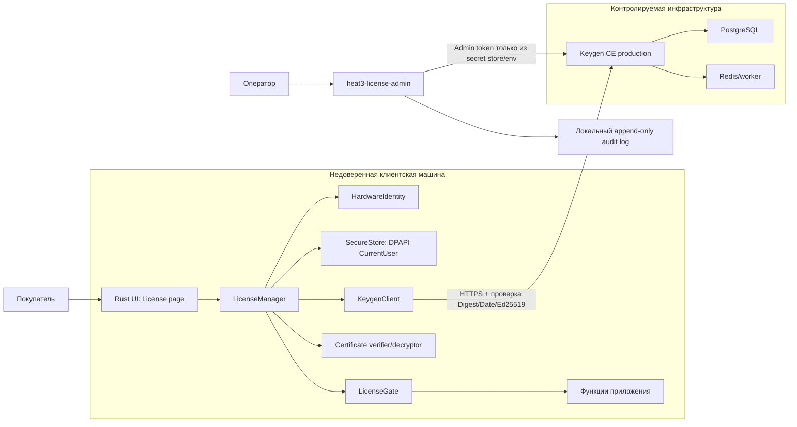

# Архитектура лицензирования HEAT3 «Поворотник» на Keygen CE

**Дата фиксации:** 2026-07-17  
**Статус:** утвержденная техническая база для реализации; бизнес-параметры с пометкой `Decision gate` подтверждаются перед production  
**Область:** Rust-приложение Windows, self-hosted Keygen CE, операторская выдача и управление лицензиями  
**Канонический код приложения:** `rust/`

## Прогресс реализации

Состояние на 2026-07-17:

- W1 — завершен: Python legacy заархивирован с SHA-256 manifest и удален из проекта;
- W2 — завершен: доменные состояния, ограниченный offline lease и thread-safe LicenseGate;
- W3 — завершен: SMBIOS/Windows hardware identity hw-v1 и DPAPI CurrentUser storage;
- W4 — завершен на стороне клиента: HTTPS-only Keygen client, обязательная Ed25519-проверка сырых HTTP-ответов, validation/activation/recovery/check-in/checkout/deactivation и проверка AES-256-GCM machine-file;
- W5 — клиентская реализация завершена: неблокирующий `LicenseManager`, локальное восстановление, периодический refresh каждые 15 минут, fail-closed gate, recovery path для blocked states и schema-v2 migration для secure storage. Реальный staging E2E ожидает параметры W0;
- W6 — локальная реализация завершена: отдельный от клиента Rust CLI для issue/list/show/suspend/reinstate/renew/reset/revoke, runtime-only Bearer token, рекурсивная маскировка и HMAC-SHA256 audit chain. Операторская приемка ожидает staging W0;
- W7 — self-review и локальные security gates обновлены на 2026-07-27: дополнительно исправлены recovery-path для blocked states, межпроцессное stale-state overwrite, schema-v2 storage migration и pinning CI actions. Отчет: `docs/reviews/2026-07-17-keygen-licensing-security-review.md`. Независимый review, live failure matrix и замена устаревшего `three-d`/`cgmath` остаются до production;
- W8 — не начат. W0 остается внешним блокером для интеграционного прогона: staging Keygen CE и реальные account/product/policy/public-key параметры не предоставлены.

## 1. Цель и критерии готовности

Нужно получить профессиональную схему лицензирования, которая:

- принимает выданный покупателю лицензионный ключ в UI;
- активирует одну лицензию на одном компьютере;
- допускает ограниченную работу без сети;
- позволяет удаленно приостановить лицензию;
- переживает допустимую замену одного аппаратного компонента, но не простое копирование состояния на другой ПК;
- не хранит административные секреты в клиенте;
- криптографически проверяет данные Keygen до выдачи доступа к функциям;
- не блокирует легального пользователя из-за краткого сетевого сбоя;
- дает оператору отдельный безопасный инструмент выдачи, блокировки, восстановления и сброса активации;
- имеет проверяемые сценарии отказа, восстановления и миграции.

Готовность подтверждается не наличием окна активации, а прохождением тестовой матрицы из раздела 16 и production-readiness gate из раздела 18.

## 2. Явные ограничения и модель угроз

### 2.1. От чего защищаемся

- передача одного ключа нескольким покупателям;
- копирование локального файла лицензии на другой компьютер или в другую учетную запись Windows;
- подмена ответа API простым прокси/MITM;
- редактирование локального состояния, даты последней проверки или срока офлайн-доступа;
- использование отозванной лицензии после следующего обязательного контакта с сервером;
- небольшие законные изменения компьютера: замена диска, переустановка Windows или замена одного компонента;
- случайная утечка ключа через логи, дампы ошибок и UI.

### 2.2. Что нельзя обещать

Клиентское приложение находится на компьютере покупателя, поэтому его можно исследовать, патчить и запускать под отладчиком. Схема не может гарантировать абсолютную защиту от администратора/ядрового вредоносного ПО, целевой модификации бинарника, компрометации production-сервера или полного клона виртуальной машины со всеми идентификаторами.

Keygen также прямо указывает, что полностью надежно обнаружить манипуляцию временем в постоянно офлайн-среде нельзя: доверенную актуальность дает только периодическая связь с API. Поэтому удаленная блокировка имеет ограниченную задержку, равную максимальному сроку подписанного офлайн-сертификата. Мгновенная блокировка и полноценный офлайн-режим несовместимы.

## 3. Исследованная база и принятые допущения

Архитектура сверена с официальной документацией на 2026-07-17:

- [Keygen CE/self-hosting](https://keygen.sh/docs/self-hosting/) — состав CE, эксплуатационные зависимости и серверные секреты;
- [валидация лицензий](https://keygen.sh/docs/api/licenses/) — коды результата, области проверки, suspend/reinstate/revoke и checkout;
- [активация машин](https://keygen.sh/docs/activating-machines/) и [Machine API](https://keygen.sh/docs/api/machines/) — node-locked активация и offline machine files;
- [криптография license/machine files](https://keygen.sh/docs/api/cryptography/) и [подписи HTTP-ответов](https://keygen.sh/docs/api/signatures/) — Ed25519, AES-256-GCM, Digest/Date и порядок проверки;
- [безопасность API](https://keygen.sh/docs/api/security/) и [авторизация](https://keygen.sh/docs/api/authorization/) — запрет встраивания административных токенов и ограничения офлайн-проверки;
- [hardware components](https://keygen.sh/docs/api/components/) и [политики](https://keygen.sh/docs/api/policies/) — устойчивое сопоставление нескольких аппаратных признаков;
- [официальный Rust-пример проверки файлов](https://github.com/keygen-sh/example-rust-cryptographic-license-files);
- [Microsoft DPAPI / CryptProtectData](https://learn.microsoft.com/en-us/windows/win32/api/dpapi/nf-dpapi-cryptprotectdata) — привязка локального секрета к пользователю Windows и компьютеру.

Допущения v1:

- целевая платформа — Windows;
- одна лицензия активируется максимум на одном компьютере;
- рекомендуемый офлайн-срок — 7 суток;
- фоновая онлайн-проверка выполняется не реже одного раза в 24 часа при наличии сети;
- production и staging — разные экземпляры Keygen CE с отдельными БД, доменами и секретами;
- `rust/` остается каноническим корнем приложения; перенос всего Rust-проекта в корень не совмещается с лицензированием.

`Decision gate`: перед production владелец продукта подтверждает 7 суток либо выбирает иной предел. Это одновременно максимальная гарантированная задержка удаленной блокировки для компьютера, который не выходит в сеть.

### 3.1. Реестр незакрытых бизнес-решений

Они не меняют границы архитектуры и не блокируют начало W1–W4, но блокируют production:

| ID | Решение | Рекомендуемый default | Кто подтверждает | Дедлайн |
|---|---|---|---|---|
| DG-01 | Максимальный офлайн-срок | 7 суток | Владелец продукта | До W5 |
| DG-02 | Коммерческие тарифы и expiry | Один policy template на каждый отличающийся набор прав; срок задавать на license | Владелец продукта | До W0 completion |
| DG-03 | Правила ручного переноса на новый ПК | После проверки покупателя, с audit; лимит задается регламентом поддержки | Владелец продукта/поддержка | До W6 |
| DG-04 | Production domain и владелец инфраструктуры | Отдельный стабильный HTTPS domain | Владелец инфраструктуры | До W8 |
| DG-05 | Правовые условия Keygen CE и privacy notice | Формальная проверка до коммерческого релиза | Владелец продукта/юрист | До W8 |

## 4. Архитектурные решения

| ID | Решение | Обоснование |
|---|---|---|
| ADR-01 | Два контура: клиентское приложение покупателя и отдельный операторский CLI | Клиент не должен содержать токены с правами выдачи/блокировки лицензий |
| ADR-02 | Прямое HTTPS-взаимодействие клиента с Keygen CE в v1 | Keygen допускает machine activation/checkout с авторизацией лицензионным ключом; отдельный broker пока не нужен |
| ADR-03 | Node-locked policy: 1 машина, строгая проверка product/policy/components | Ограничивает совместное использование ключа и исключает проверку «не той» лицензии |
| ADR-04 | Подписанный и зашифрованный machine file с TTL 7 суток | Дает проверяемый офлайн-доступ и ограниченную задержку отзыва |
| ADR-05 | Алгоритм файла фиксирован как `aes-256-gcm+ed25519` | Шифрование связывает файл с ключом и fingerprint, подпись подтверждает происхождение |
| ADR-06 | Локальный envelope защищается DPAPI CurrentUser и ACL | Простое копирование файла на другой ПК/пользователя не дает рабочее состояние |
| ADR-07 | Public key, account/product/policy IDs и production API URL зашиваются в подписанный бинарник | Внешняя конфигурация позволила бы подменить доверенный сервер/аккаунт; приватных ключей в клиенте нет |
| ADR-08 | Любой доступ к функциям проходит через единый `LicenseGate` | Нельзя ограничиваться скрытием UI: бизнес-операции должны проверять состояние повторно |
| ADR-09 | Сетевой сбой не равен недействительной лицензии; криптографическая/структурная ошибка закрывает доступ | Устраняет ложные блокировки и fail-open при подмене данных |
| ADR-10 | Удаленная блокировка выполняется `suspend`; `revoke` — отдельная необратимая операция | Suspend обратим, revoke удаляет лицензию и связанные машины |
| ADR-11 | Для staging и production используются отдельные Keygen CE deployments | В CE нет environments; тестовые ключи и production-данные нельзя смешивать |
| ADR-12 | Python удаляется только после внешнего архива и SHA-256 manifest | В текущей папке нет Git, поэтому обычное удаление необратимо |

## 5. Схема компонентов и границы доверия



Клиентская машина считается недоверенной. Embedded public key — корень проверки происхождения ответа/сертификата, но бинарник сам должен распространяться с Authenticode-подписью и через подписанный канал обновления.

## 6. Конфигурация Keygen CE

### 6.1. Policy v1

Рекомендуемые параметры:

- `maxMachines = 1`;
- `strict = true`;
- `protected = false`, чтобы владелец ключа мог активировать/деактивировать только свою машину;
- обязательные product и policy scopes;
- `requireComponentsScope = true`;
- `componentMatchingStrategy = MATCH_MOST`;
- `componentUniquenessStrategy = UNIQUE_PER_LICENSE`;
- check-in interval — 1 неделя, count — 1; клиент дополнительно делает проверку каждые 24 часа при наличии сети;
- expiration выбирается по продаваемому тарифу: бессрочная лицензия может не иметь коммерческого срока, но офлайн machine file все равно имеет TTL.

Policy ID, Product ID и Account ID фиксируются для production-сборки. Смена любого значения требует новой подписанной сборки либо заранее спроектированной ротации списка доверенных идентификаторов.

### 6.2. Состояния на сервере

- **active/valid** — разрешена активация и выдача свежего machine file;
- **suspended** — обратимая удаленная блокировка; при следующем онлайн-контакте клиент блокируется;
- **expired** — закончился коммерческий срок;
- **overdue** — нарушен обязательный check-in;
- **revoked/deleted** — необратимое удаление, только при осознанной операторской операции.

Поле общего статуса не используется как единственный источник истины: решение принимается по результату validation и его `meta.code`.

## 7. Профессиональная привязка к оборудованию

### 7.1. Принцип

Не использовать MAC-адрес как основной fingerprint: он меняется, виртуализируется и легко подменяется. Не отправлять сырые серийные номера на сервер.

На Windows формируется версия схемы `hw-v1`:

1. Основной machine fingerprint:
   - нормализованный SMBIOS System UUID;
   - fallback: нормализованная комбинация SMBIOS system serial + baseboard serial;
   - последний слабый fallback: Windows MachineGuid.
2. Fingerprint рассчитывается как domain-separated SHA-256, например `SHA256("heat3/machine/v1\0" || normalized_value)`.
3. Components рассчитываются отдельно с типовым префиксом:
   - SMBIOS System UUID;
   - SMBIOS system serial;
   - baseboard serial;
   - chassis serial;
   - serial системного тома;
   - Windows MachineGuid.
4. Пустые/шаблонные значения (`0000…`, `To Be Filled By O.E.M.`, слишком короткие или одинаковые строки) отбрасываются.
5. На сервер передаются только тип и хэш компонента.

### 7.2. Допуск к изменению железа

Для четырех и более качественных компонентов `MATCH_MOST` разрешает изменение одного признака и требует совпадения большинства. Это покрывает типичные случаи замены диска или переустановки Windows, не превращая один изменившийся компонент в новую активацию.

Если доступно менее трех качественных компонентов, активация помечается как `weak hardware identity`. В production рекомендуется:

- при двух компонентах разрешить активацию только с явной записью в операторском аудите;
- при одном компоненте требовать ручное решение оператора;
- не строить автоматический rehost на одном слабом идентификаторе.

### 7.3. Rehost и замена компьютера

Покупатель не получает возможность бесконечно сбрасывать привязку. Штатный перенос:

1. На старом ПК — онлайн-деактивация machine.
2. На новом — обычная активация тем же ключом.
3. При поломке старого ПК — операторский `reset-machine` после проверки покупателя.

Политика частоты ручных rehost — бизнес-решение, но каждое действие записывается в audit log.

## 8. Криптографический протокол и локальное хранение

### 8.1. Что встроено в клиент

Допустимо встроить:

- production API base URL;
- Keygen Account ID, Product ID, Policy ID;
- Ed25519 public key;
- точную строку ожидаемого алгоритма;
- версию fingerprint/storage schema.

Запрещено встраивать:

- admin/product/environment tokens;
- приватный ключ подписи;
- серверные Rails/Keygen encryption secrets;
- учетные данные БД/Redis;
- универсальный симметричный секрет для всех клиентов.

### 8.2. Проверка сетевого ответа

Для security-sensitive ответов `KeygenClient`:

1. получает сырые байты тела;
2. проверяет HTTPS и допустимый host;
3. проверяет обязательные `Digest`, `Date` и Ed25519 response signature по embedded public key;
4. отклоняет ответ со старым/аномальным `Date` за пределами допустимого окна;
5. только после этого разбирает JSON;
6. применяет allowlist ожидаемых account/product/policy/license/machine IDs и validation code.

Неподписанная ошибка, ошибка JSON или неизвестный код никогда не дают доступ. Сетевой timeout рассматривается отдельно и может привести к офлайн-проверке уже сохраненного сертификата.

### 8.3. Offline machine file

После успешной онлайн-валидации клиент запрашивает machine checkout:

- TTL по умолчанию `604800` секунд;
- ожидаемый algorithm строго `aes-256-gcm+ed25519`;
- подпись Ed25519 проверяется до использования содержимого;
- ключ AES выводится согласно формату Keygen из лицензионного ключа и activation fingerprint;
- после расшифровки проверяются schema, account/product/policy/license/machine, fingerprint/components, issued/expiry и entitlements.

Содержимое нельзя использовать после одной лишь успешной расшифровки: аутентичность, ожидаемый алгоритм и все контекстные поля обязательны.

### 8.4. DPAPI envelope

Файл: `%LOCALAPPDATA%\HEAT3\Povorotnik\license.v1.bin`.

Перед шифрованием DPAPI структура содержит:

```text
schema_version
license_key
license_id
machine_id
activation_fingerprint
fingerprint_schema_version
hashed_components
encrypted_signed_machine_file
last_successful_online_server_time
max_observed_trusted_time
offline_valid_until
authoritative_block
deactivation_pending
last_validation_code
last_error_class
```

Требования:

- DPAPI CurrentUser, без `CRYPTPROTECT_LOCAL_MACHINE`;
- `CRYPTPROTECT_UI_FORBIDDEN`;
- дополнительная entropy-константа приложения допустима, но не считается отдельным секретом;
- ACL каталога и файла — текущий пользователь;
- запись через временный файл, flush/fsync и атомарную замену;
- формат имеет magic/version/length/checksum до DPAPI для обнаружения обрыва записи;
- чувствительные буферы по возможности очищаются через `zeroize`;
- ключ никогда не попадает в `Debug`, telemetry, panic report или обычный log.

DPAPI защищает данные «на диске» и от простого копирования, но не от процесса с правами того же пользователя или администратора. Это defense in depth, а не единственная граница безопасности.

### 8.5. Манипуляция временем

- сохранять максимальное доверенное server time из проверенного ответа;
- сохранять максимальное наблюдавшееся локальное UTC вместе с monotonic checkpoint в рамках сессии;
- если системное время откатилось более чем на 5 минут относительно доверенного максимума — состояние `NeedsOnline`;
- никогда не продлевать TTL на основании локального времени;
- удаление, повреждение или невозможность расшифровать envelope означает `Unlicensed/Tampered`, а не новый бесплатный офлайн-период.

Это не устраняет все атаки на часы, но не позволяет простым откатом автоматически продлевать ранее выданный lease.

## 9. Протоколы

### 9.1. Первая активация

1. UI нормализует ввод ключа, но не логирует его.
2. `HardwareIdentity` вычисляет primary fingerprint и components.
3. `validate-key` вызывается с обязательными product, policy, fingerprint/components scopes.
4. Сырой ответ проходит криптографическую проверку до JSON parsing.
5. `NO_MACHINE`/эквивалентное ожидаемое состояние разрешает переход к активации; suspended, expired, mismatched и неизвестные состояния запрещают его.
6. Клиент создает machine, авторизуясь только этим license key, и передает hashed components.
7. Повторно выполняет scoped validation.
8. Выполняет license check-in.
9. Запрашивает encrypted/signed machine file с TTL 7 суток.
10. Локально проверяет и расшифровывает файл, затем проверяет все assertions.
11. Только после успешной полной проверки атомарно записывает DPAPI envelope.
12. `LicenseGate` получает `OnlineValid`; UI открывает приложение.

Если machine был создан, а последующий checkout/storage упал, клиент повторно обнаруживает существующую machine и завершает операцию идемпотентно. Он не создает дубликат.

### 9.2. Старт приложения

1. Загрузить и DPAPI-расшифровать envelope.
2. Проверить schema, integrity и отсутствие clock rollback.
3. Проверить подпись, algorithm, расшифровать machine file и проверить assertions.
4. Если сеть доступна и проверка просрочена на 24 часа — запустить refresh асинхронно.
5. Пока refresh идет, разрешить работу только в пределах действующего offline TTL.
6. Если сеть недоступна, но TTL действителен — `OfflineLease`.
7. Если TTL истек — `NeedsOnline`, функциональность закрыта.

UI-поток не блокируется сетевыми операциями; состояние передается через thread-safe snapshot/event channel.

### 9.3. Фоновое обновление

1. Scoped validation текущей machine.
2. Немедленная блокировка на `SUSPENDED`, `EXPIRED`, `OVERDUE`, `NOT_FOUND`, machine/component mismatch.
3. При valid — check-in, новый checkout, локальная полная проверка, атомарная замена envelope.
4. При network/service unavailable — сохранить старый lease без продления и показать предупреждение.
5. При signature/tamper/protocol error — `Tampered/NeedsOnline`, доступ не продлевать.

### 9.4. Удаленная блокировка

Оператор выполняет `suspend`. Онлайн-клиент блокируется при ближайшем refresh. Полностью офлайн-клиент продолжит работать только до `offline_valid_until`, максимум 7 суток по умолчанию. При восстановлении оператор выполняет `reinstate`, после чего клиенту нужен онлайн-refresh.

`revoke` требует двойного подтверждения и ручного ввода license ID: действие необратимо и удаляет связанные machines.

### 9.5. Деактивация пользователем

- доступна только онлайн;
- выполняет DELETE только текущей machine с authorization текущим license key;
- после подтвержденного ответа удаляет локальный envelope;
- при сетевой ошибке не сообщает, что место освобождено;
- отдельное «Удалить локальные данные» допускается только с предупреждением, что серверная активация останется и понадобится операторский reset.

## 10. Машина состояний клиента

| Состояние | Доступ к функциям | Причина/переход |
|---|---:|---|
| `Unlicensed` | Нет | Нет локальной лицензии |
| `Activating` | Нет | Идет первая онлайн-активация |
| `OnlineValid` | Да | Свежая подтвержденная validation + machine file |
| `OfflineLease` | Да | Сеть недоступна, подписанный TTL еще действует |
| `ServiceUnavailable` | Да, только пока действует TTL | Keygen временно недоступен |
| `NeedsOnline` | Нет | TTL истек, часы откатились либо требуется восстановление |
| `Suspended` | Нет | Сервер вернул suspended |
| `Expired` | Нет | Коммерческий срок истек |
| `HardwareMismatch` | Нет | Fingerprint/components не соответствуют activation |
| `Tampered` | Нет | Ошибка подписи, алгоритма, DPAPI, структуры или контекста |

Переход из блокирующего состояния в разрешающее возможен только после криптографически подтвержденной онлайн-проверки либо валидного ранее сохраненного lease. Простая перезагрузка приложения состояние не сбрасывает.

## 11. Rust-модули и зависимости

Планируемая структура:

```text
rust/src/licensing/
  mod.rs                 # публичный фасад LicenseManager
  model.rs               # состояния, коды, DTO без утечек секретов
  config.rs              # embedded production trust configuration
  hardware.rs            # Windows hardware identity hw-v1
  keygen_client.rs       # HTTP, signatures, validation/machine/check-in/checkout
  certificate.rs         # Ed25519 + AES-256-GCM machine file
  storage.rs             # DPAPI CurrentUser, ACL, atomic persistence
  clock.rs               # trusted time и rollback detection
  gate.rs                # capability checks для функций приложения

rust/src/ui/license_page.rs
rust/src/bin/heat3_license_admin.rs
rust/tests/licensing_*.rs
```

Предполагаемые crates: `reqwest` с Rustls, `serde`/`serde_json`, `ed25519-dalek`, `aes-gcm`, `sha2`, `base64`, `secrecy`/`zeroize`, `windows`, `thiserror`, `time`/`httpdate`, `uuid`, `tempfile`. Точные актуальные версии выбираются при реализации, фиксируются в `Cargo.lock`, проходят `cargo audit` и review лицензий зависимостей.

`LicenseManager` предоставляет UI только безопасный snapshot: masked key, timestamps, human-readable state и допустимые actions. Сырой ключ не клонируется в модель UI.

## 12. UI менеджера лицензий

### 12.1. Неактивированное состояние

- отдельная страница/модальное окно «Лицензия» до доступа к рабочим функциям;
- поле ключа скрыто по умолчанию, кнопки «Показать» и «Вставить»;
- явное сообщение, что для первой активации нужен интернет;
- кнопка «Активировать» с progress/cancel-safe состоянием;
- ссылка на краткое описание аппаратной привязки и privacy notice;
- ошибки переводятся из стабильных внутренних кодов, без показа сырого ответа и stack trace.

### 12.2. Активированное состояние

- статус: активна / офлайн / требуется интернет / приостановлена / истекла;
- маска ключа, максимум последние 4 символа;
- имя и идентификатор этой machine в безопасной форме;
- коммерческий срок, если есть;
- «Офлайн до …» и «Последняя проверка …»;
- кнопки «Проверить сейчас» и «Деактивировать на этом компьютере»;
- желтый non-blocking banner в `OfflineLease`, красный blocking screen в suspended/expired/tampered.

### 12.3. Сообщения по причинам

- network unavailable: «Нет связи с сервером. Лицензия действует офлайн до …»;
- TTL expired: «Для продолжения подключитесь к интернету и обновите лицензию»;
- suspended: «Лицензия приостановлена. Обратитесь к поставщику»;
- max machines/no machine slot: «Ключ уже активирован на другом компьютере»;
- hardware mismatch: «Изменился состав оборудования; требуется перенос/поддержка»;
- invalid/not found: «Ключ не найден или введен неверно»;
- protocol/tamper: нейтральное пользовательское сообщение + локальный redacted diagnostic ID.

Кнопки и состояния должны соответствовать существующему стилю egui-приложения; сетевые операции не должны замораживать перерисовку, перемещение окна или обработку resize.

## 13. Операторский менеджер лицензий

В v1 — отдельный Rust CLI `heat3-license-admin`, который не входит в клиентский installer.

Команды:

- `issue` — создать лицензию по выбранной policy, сроку и customer reference;
- `show`/`list` — найти лицензию без вывода полного ключа по умолчанию;
- `suspend` и `reinstate`;
- `renew`/изменение expiry;
- `machines` и `reset-machine`;
- `revoke` — только с `--confirm <license-id>` и интерактивным предупреждением;
- `audit-export`.

Admin token поступает только через OS secret manager либо одноразовую environment variable процесса. CLI запрещает передачу токена в аргументах командной строки, config в репозитории и log. Выданный ключ показывается оператору один раз либо сохраняется в одобренную CRM/secret-aware систему.

Keygen CE не предоставляет полный набор EE audit/request logs и расширенных ролей. Поэтому CLI пишет append-only JSONL audit:

- timestamp UTC;
- operator identity/workstation;
- command/action;
- license ID/customer reference;
- before/after state без полного ключа;
- request correlation ID;
- hash предыдущей записи и hash текущей записи.

Также сохраняются reverse-proxy access logs без Authorization header/body. Если появляется несколько операторов, обязательный аудит или разделение ролей, decision gate — Keygen EE/Cloud либо собственный broker с аутентификацией и RBAC. Локальная hash-chain не равна независимому защищенному аудиту.

## 14. Эксплуатация Keygen CE

- отдельные staging и production domains/БД/Redis/secrets;
- фиксированный официальный release/container digest;
- TLS на reverse proxy, firewall и отсутствие прямого публичного доступа к Postgres/Redis;
- `SECRET_KEY_BASE`, encryption keys/salt и DB credentials — вне репозитория, с резервной копией в защищенном secret store;
- регулярный backup PostgreSQL вместе с необходимыми Keygen encryption/signing secrets;
- квартальная проверка восстановления на отдельном стенде;
- health checks для web, worker, PostgreSQL и Redis;
- мониторинг latency, 5xx, очереди worker, диска, срока TLS и результата backup;
- ограничение размера запроса и rate limit на proxy без блокировки легитимных refresh;
- обновление Keygen CE сначала на staging; CE получает релизы реже и не гарантирует backport исправлений;
- аварийная процедура: при недоступности сервера клиенты используют только уже выданный TTL, серверный outage не создает новый lease.

Нельзя потерять серверные cryptographic/encryption secrets: backup только БД без ключей может оказаться невосстановимым. Восстановление считается рабочим лишь после validation и checkout тестовой лицензии.

Отдельный legal gate: проверить условия лицензии self-hosted Keygen CE/Fair Core для выбранного коммерческого использования и зафиксировать приемлемую версию. Это не техническое утверждение о юридической совместимости.

## 15. Очистка проекта от Python-версии

### 15.1. Защитный шаг

В текущей папке нет Git. До удаления:

1. создать архив Python legacy **за пределами папки проекта**;
2. добавить `SHA256SUMS.txt` и список файлов;
3. проверить чтение архива;
4. выполнить базовые Rust-проверки до и после очистки;
5. сохранить спецификации продукта как исторические требования.

### 15.2. Удалить как Python-only

```text
src/
tests/
Исходники/
build/
dist/
main.py
Povorotnik.py
povorotnik.spec
build.bat
requirements.txt
requirements-dev.txt
resources/styles.qss
resources/logocube.ico
```

После удаления Python-only assets пустой корневой `resources/` также удаляется. Rust-ресурсы находятся в `rust/resources/` и сохраняются.

### 15.3. Сохранить/переоформить

- `rust/` — канонический код и сборка;
- `docs/superpowers/specs/` — спецификации и история решений;
- `model.step`, `paste.txt`, `Пояснение.txt` — пока считаются общими образцами/справочными материалами; при очистке переместить в понятный `samples/`/`docs/`, если ссылки это позволяют;
- корневой `README.md` заменить на Rust-only описание с командами build/test/package и ссылкой на этот документ;
- не переносить `rust/` в корень в том же change set: это независимая структурная миграция без пользы для безопасности лицензии.

Удаление выполняется отдельным commit/change set после создания Git-репозитория либо проверенного архива, чтобы его можно было аудитировать и откатить.

## 16. План реализации по рабочим пакетам

### 16.1. Карта выполнения

| Пакет | Ответственная роль | Зависимости | Главный артефакт | Доказательство | Откат/безопасная остановка |
|---|---|---|---|---|---|
| W0 | Владелец продукта + DevOps | — | Решения DG, staging Keygen | Staging smoke test | Не создавать production-данные |
| W1 | Разработчик | Проверенный архив | Rust-only workspace | Manifest + Rust gates | Восстановить архив по manifest |
| W2 | Rust-разработчик | Архитектура | State machine + gate | Unit/property tests | Feature flag держит gate выключенным |
| W3 | Rust/Windows-разработчик | W2 model | Hardware + DPAPI store | Cross-user/corruption tests | Не мигрировать старое состояние; удалить только новый envelope |
| W4 | Rust/security-разработчик | W0, W2 | Keygen client + crypto | Positive/negative fixtures | Staging only, production URL не включать |
| W5 | Rust/UI-разработчик | W2–W4, DG-01 | LicenseManager + UI | E2E/UI scenarios | Release feature flag/предыдущая сборка |
| W6 | Rust/operations-разработчик | W0, DG-03 | Admin CLI + audit | Operator acceptance test | CLI не поставлять до приемки |
| W7 | Security/QA/DevOps | W3–W6 | Review report + restore proof | Нет high/critical findings | Блок production rollout |
| W8 | Release owner + DevOps | W0–W7, DG-04/05 | Signed production release | Canary + rollback drill | Предыдущая подписанная сборка и server rollback |

Критический путь: `W0 → W2 → W3/W4 → W5 → W7 → W8`. W1 можно выполнять параллельно после архива; W6 — после доступности staging API. Одновременная работа W3 и W4 допустима после фиксации DTO/traits в W2.

### W0. Decision gates и стенд

**Вход:** этот документ.  
**Выход:** подтверждены offline TTL, тарифы/expiry, rehost policy, production domain; поднят staging Keygen CE.  
**Проверка:** тестовый оператор может issue/suspend/reinstate лицензию через API; секреты отсутствуют в файлах проекта.

### W1. Архив и удаление Python legacy

**Зависимость:** W0 не обязательна; нужен проверенный внешний архив.  
**Работа:** manifest, archive, удаление перечня 15.2, перенос общих samples, новый README.  
**Проверка:** в проекте нет `.py`, `.spec`, Python requirements/PyInstaller artifact; Rust build/test дает тот же результат, что до очистки.

### W2. Домен лицензирования и feature gate

**Работа:** `model`, state machine, redacted errors, `LicenseGate`, capability checks в каждом входе к рабочим операциям.  
**Проверка:** unit/property tests запрещают операции во всех блокирующих состояниях; UI-only bypass не открывает функцию.

### W3. Hardware identity и secure storage

**Работа:** `hw-v1`, фильтрация placeholder IDs, hashed components, DPAPI CurrentUser, ACL, atomic persistence, zeroization, schema migration.  
**Проверка:** копия envelope не открывается другим Windows user/компьютером; power-loss simulation сохраняет старое либо новое валидное состояние; сырых ID нет в логах.

### W4. Keygen client и certificate pipeline

**Работа:** validation, machine create/delete, check-in, checkout, raw response signature verification, Ed25519/AES-GCM, time checks, exact algorithm/context assertions, retries/idempotency.  
**Проверка:** официальные fixtures + отрицательные тесты на измененный body/signature/date/alg/account/product/policy/machine/fingerprint/expiry.

### W5. LicenseManager и UI

**Работа:** async orchestration, activation/recovery/deactivation, startup refresh, страница лицензии, status banners, localized errors.  
**Проверка:** UI не зависает при timeout; окно корректно перемещается/resize; ключ не появляется в widget diagnostics/screenshot/log; сценарии 16.1–16.12 проходят вручную.

### W6. Операторский CLI и audit

**Работа:** issue/list/show/suspend/reinstate/renew/reset/revoke; secret loading; hash-chained audit; packaging отдельно от клиента.  
**Проверка:** клиентский installer не содержит CLI/admin token; destructive action требует двойного подтверждения; audit не содержит ключей.

### W7. Security, privacy и отказоустойчивость

**Работа:** threat-model review, dependency audit, fuzzing parsers, log review, server outage/clock rollback/corrupt state/hardware replacement tests, privacy notice.  
**Проверка:** нет high/critical findings; medium имеют owner/срок; восстановление backup успешно; test signing/public keys не попали в production.

### W8. Production rollout

**Работа:** production deployment, Authenticode, installer/updater, runbook поддержки, canary лицензии, мониторинг.  
**Проверка:** чистая Windows VM проходит activation → offline → refresh → suspend → reinstate → deactivate; rollback сборки и сервера отрепетирован.

## 17. Подтверждающая тестовая матрица

| № | Сценарий | Ожидаемый результат |
|---:|---|---|
| 1 | Корректный новый ключ, сеть доступна | Одна machine создана, lease сохранен, функции открыты |
| 2 | Повтор запуска на том же ПК | Дубликат machine не создается |
| 3 | Нет сети через сутки, TTL еще действует | `OfflineLease`, функции доступны, показан срок |
| 4 | Нет сети после TTL | `NeedsOnline`, функции закрыты |
| 5 | Suspend во время онлайн-сеанса | При ближайшем refresh доступ закрыт |
| 6 | Suspend при полностью офлайн-клиенте | Доступ только до прежнего TTL, затем закрыт |
| 7 | Reinstate | После онлайн-refresh доступ восстановлен |
| 8 | Копирование envelope другому Windows user/ПК | DPAPI/decryption failure, доступа нет |
| 9 | Изменение одного разрешенного компонента | Machine проходит majority match |
| 10 | Перенос состояния на существенно другой ПК | Hardware mismatch, доступа нет |
| 11 | Подмена JSON/подписи/Digest/Date/alg | `Tampered`, доступа нет |
| 12 | Откат часов | `NeedsOnline`, TTL не продлевается |
| 13 | Keygen 5xx/timeout при действующем lease | Старый TTL не меняется, приложение работает офлайн |
| 14 | Keygen 5xx/timeout без lease | Fail closed, понятная ошибка |
| 15 | Повреждение записи во время сохранения | Загружается прежняя валидная версия либо fail closed |
| 16 | Онлайн-деактивация | Machine удалена, локальное состояние удалено |
| 17 | Revoke через CLI | Требует double confirmation, лицензия не восстанавливается |
| 18 | Поиск секретов в release artifact/logs | Admin/server secrets и полный ключ отсутствуют |
| 19 | Восстановление production backup на стенде | Существующий тестовый ключ валидируется, checkout проверяется |
| 20 | Перемещение/resize окна во время refresh | Нет артефактов, зависания и синхронной блокировки UI |

## 18. Production-readiness gate

Релиз лицензирования разрешен, когда одновременно выполнено:

- все W0–W8 закрыты подтверждаемыми артефактами;
- тесты раздела 17 пройдены на чистой Windows VM и реальном ПК;
- offline TTL и rehost policy утверждены владельцем продукта;
- production public key/IDs/API URL проверены двумя людьми либо автоматизированным release check;
- admin credentials отсутствуют в source, binaries, installer, CI logs и crash dumps;
- backup + secrets restore доказан практическим тестом;
- server runbook содержит suspend/reinstate, lost PC, outage, compromise и key rotation;
- юридическая проверка self-hosted Keygen CE и privacy notice завершены;
- приложение и installer подписаны Authenticode;
- security review не содержит незакрытых high/critical проблем.

## 19. Риски и решения

| Риск | Влияние | Мера |
|---|---|---|
| Покупатель остается офлайн после suspend | До 7 суток доступа | Уменьшить TTL для более строгого бизнеса; явно принять trade-off |
| Полный VM clone | Возможен одинаковый hardware identity | Зафиксировать ограничение; для high-value лицензий — будущий broker + TPM attestation |
| Потеря Keygen secrets | Невозможность нормального восстановления | Совместный backup БД и secrets, restore drills |
| CE не имеет EE audit/environments/RBAC | Ограниченная операторская отчетность | Раздельные deployments, operator CLI audit; при росте перейти на EE/Cloud/broker |
| Патч клиентского бинарника | Обход локального gate опытным атакующим | Централизованный gate, несколько проверок, signing/update integrity; не обещать абсолютную защиту |
| Смена железа у легального пользователя | Ложный hardware mismatch | Majority components и управляемый rehost |
| Утечка полного ключа из поддержки | Несанкционированная попытка активации | Маскирование, redacted logs, one-time delivery, maxMachines=1 |
| Ошибка времени | Блокировка или лишний офлайн-доступ | Trusted server time, rollback detection, bounded TTL |
| Юридическая несовместимость Keygen CE | Риск эксплуатации | Обязательный legal gate до production |

## 20. Не включено в v1

- собственный licensing broker/customer portal;
- автоматическая онлайн-оплата и выдача ключей;
- TPM remote attestation;
- плавающие сетевые/concurrent licenses;
- мобильные/macOS/Linux идентификаторы;
- полноценный multi-operator RBAC поверх CE;
- попытка сделать офлайн-лицензию бессрочной и одновременно мгновенно отзывной.

Эти расширения не требуют менять базовые границы: клиент по-прежнему доверяет только embedded public key и подписанному ограниченному lease, а административные полномочия остаются вне клиентского приложения.
